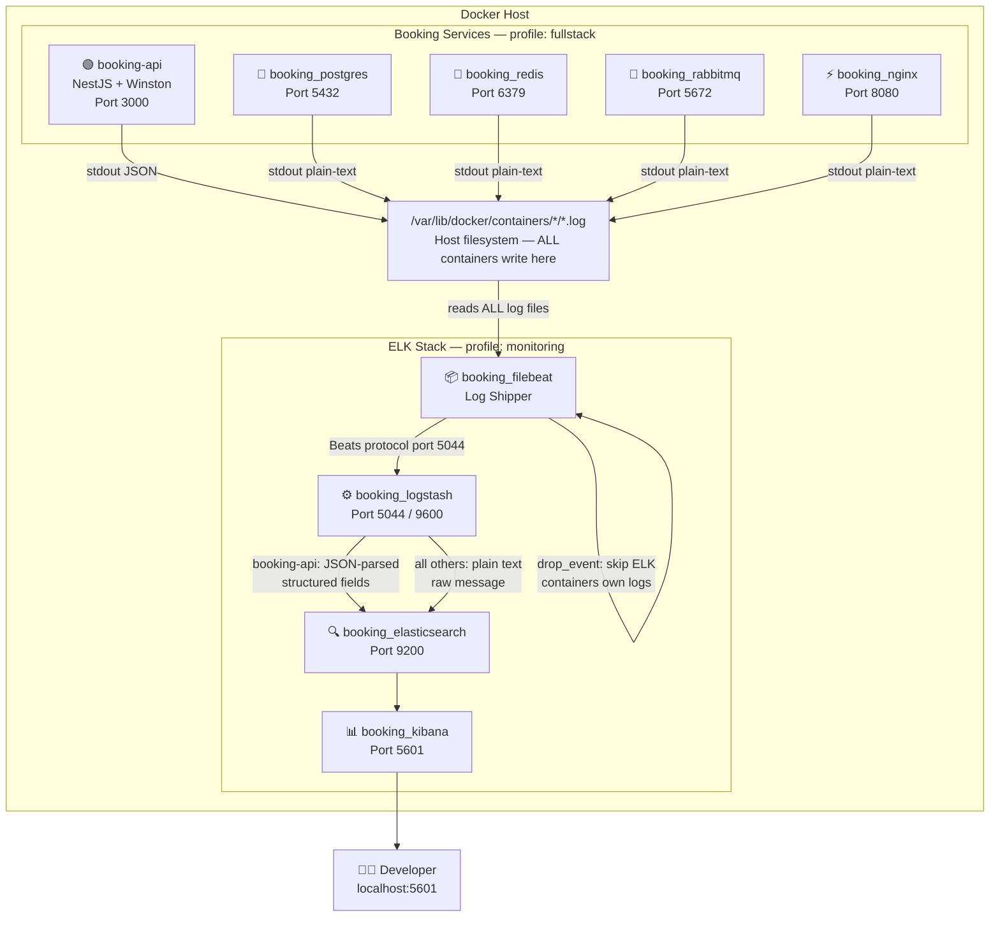
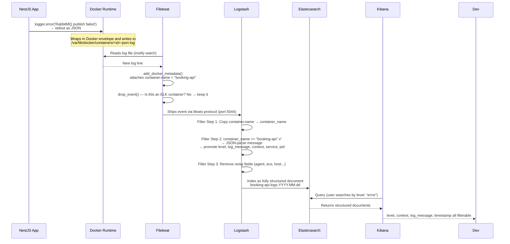
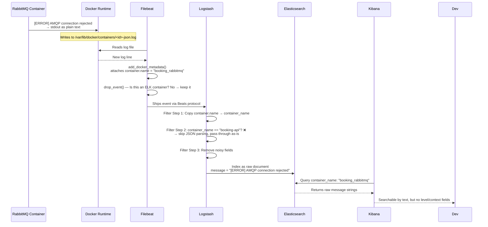
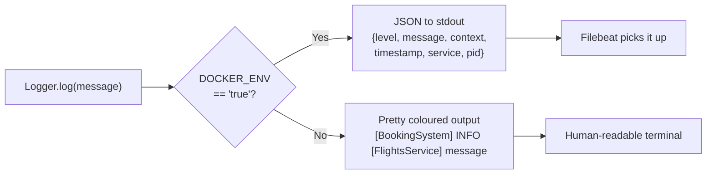
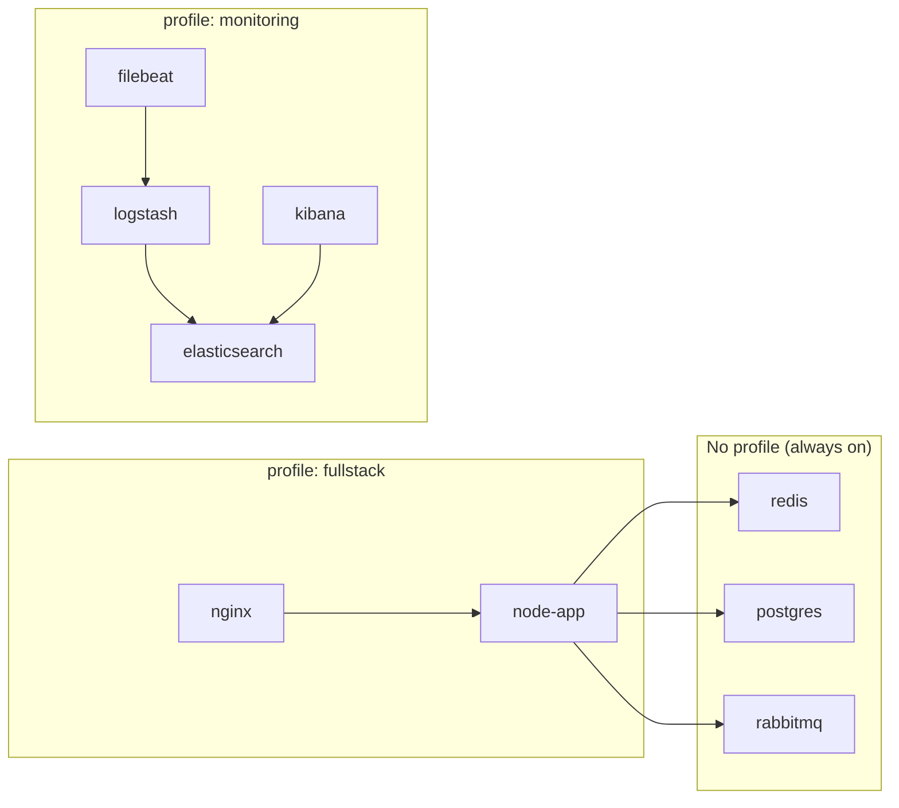
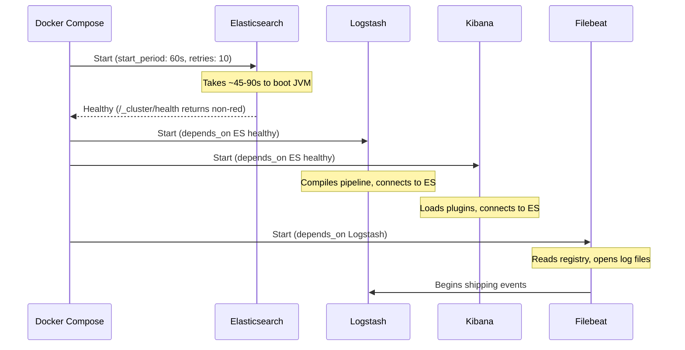
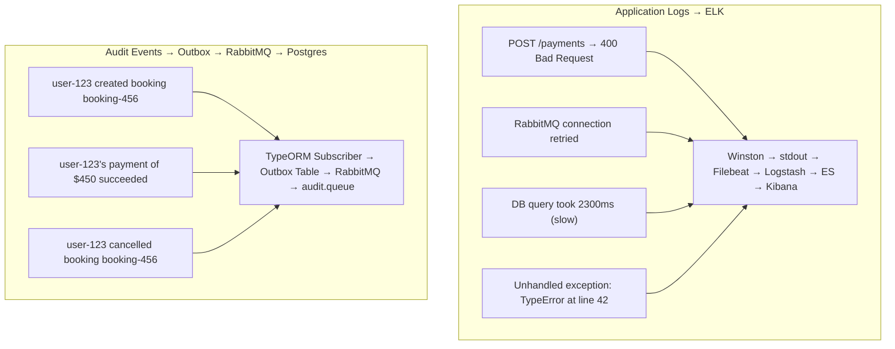

# ELK Stack — Centralized Logging Documentation

> **Branch:** `ELK-Stack`  
> **Author:** Booking System Team  
> **Last Updated:** July 2026  
> **Stack Version:** ELK 8.13.0

---

## Table of Contents

1. [Why ELK?](#1-why-elk)
2. [Architecture Overview](#2-architecture-overview)
3. [How a Log Travels (End-to-End Flow)](#3-how-a-log-travels-end-to-end-flow)
4. [Component Deep-Dive](#4-component-deep-dive)
   - [Winston (NestJS App)](#41-winston-nestjs-app)
   - [Filebeat](#42-filebeat)
   - [Logstash](#43-logstash)
   - [Elasticsearch](#44-elasticsearch)
   - [Kibana](#45-kibana)
5. [File Structure](#5-file-structure)
6. [Docker Compose Profile System](#6-docker-compose-profile-system)
7. [Configuration Reference](#7-configuration-reference)
8. [Running the Stack](#8-running-the-stack)
9. [Kibana: First-Time Setup](#9-kibana-first-time-setup)
10. [Logs vs Audit Events](#10-logs-vs-audit-events)
11. [Known Pitfalls & Fixes](#11-known-pitfalls--fixes)
12. [Extending the Stack](#12-extending-the-stack)

---

## 1. Why ELK?

Before ELK, logs lived inside individual Docker containers. To debug an issue you had to:

```bash
docker logs booking-api        # only one container at a time
docker logs booking_postgres   # no cross-container correlation
```

With ELK, **all** logs flow into a single searchable store. You can:

- Full-text search across every service in real time
- Filter by log level (`ERROR`, `WARN`), NestJS context, timestamp range
- Set up alerting for repeated errors
- Keep a permanent log history even after containers are restarted

---

## 2. Architecture Overview



> [!IMPORTANT]
> **All container logs land in Elasticsearch — no exceptions.**
> Filebeat ships every container's stdout. The `container_name == "booking-api"` condition
> in Logstash only controls **JSON field parsing and promotion** — it does NOT drop or exclude
> anything. Redis, RabbitMQ, Postgres, and Nginx logs are all indexed. They just arrive as
> a raw `message` string without promoted fields (`level`, `context`, etc.).
>
> **Searching infra logs in Kibana:**
> ```
> container_name: "booking_rabbitmq"   → RabbitMQ's own logs
> container_name: "booking_postgres"   → Postgres logs
> container_name: "booking_redis"      → Redis logs
> container_name: "booking_nginx"      → Nginx access/error logs
> ```


### Key Design Decisions

| Decision | Why |
|----------|-----|
| **Filebeat** reads Docker log files, not app → Logstash directly | Decouples the app from the logging pipeline. If Logstash is down, Filebeat buffers. No code change needed to swap transports. |
| **`monitoring` Docker profile** | ELK is opt-in. `docker compose up` works exactly as before — no extra RAM used unless you explicitly start ELK. |
| **Winston JSON format** | Structured logs can be queried field-by-field in Kibana (`level`, `context`, `message`). Plain text is unsearchable. |
| **Dev security off** (`xpack.security.enabled=false`) | No passwords or TLS needed in development. Easy to enable later for production. |

---

## 3. How a Log Travels (End-to-End Flow)

There are **two paths** — one for your NestJS app (structured JSON), one for infrastructure containers (plain text). Both end up in Elasticsearch.

### Path A — NestJS App (booking-api)



### Path B — Infrastructure Containers (rabbitmq, redis, postgres, nginx)



### The Two-Signal Model for Infrastructure Failures

When RabbitMQ goes down you get **two independent signals in Kibana**:

| Signal | KQL Query | What you see |
|--------|-----------|-------------|
| RabbitMQ's own crash logs | `container_name: "booking_rabbitmq"` | Internal broker errors, connection resets |
| NestJS app's reaction | `level: "error" AND context: "RabbitMQService"` | "Failed to publish", retry attempts, stack traces |

The NestJS signal is usually more actionable because it tells you **which operation failed** and **which user/request was affected**, not just that the broker had a problem.

> [!NOTE]
> The terminal flooding we fixed earlier had nothing to do with infrastructure logs being too
> noisy. It was caused by two separate bugs:
> 1. `stdout { rubydebug }` in the Logstash pipeline printing every event to terminal
> 2. A feedback loop where ELK containers' own logs were being shipped back into Logstash

---

## 4. Component Deep-Dive

### 4.1 Winston (NestJS App)

**What it does:** Replaces NestJS's built-in `Logger` with a structured logger that outputs machine-readable JSON in Docker environments.

**Location:** [`src/common/logger/winston.config.ts`](src/common/logger/winston.config.ts)

**Environment-aware output:**



**Sample JSON log line emitted in Docker:**
```json
{
  "level": "info",
  "message": "[afterInsert] FlightBooking abc-123 by user-456",
  "context": "FlightBookingSubscriber",
  "timestamp": "2026-07-20T14:00:00.000Z",
  "service": "booking-api",
  "pid": 1
}
```

**Integration points:**

| File | Change | Purpose |
|------|--------|---------|
| `src/app.module.ts` | `WinstonModule.forRoot(winstonConfig)` | Registers Winston globally |
| `src/main.ts` | `app.useLogger(app.get(WINSTON_MODULE_NEST_PROVIDER))` | Sets Winston as the NestJS logger |
| `src/main.ts` | `bufferLogs: true` in `NestFactory.create` | Buffers bootstrap logs until Winston is ready |

**Using the logger in any service (no change needed):**
```typescript
// Nothing changes in your existing services —
// NestJS's Logger class now routes through Winston automatically
private readonly logger = new Logger(FlightsService.name);

this.logger.log('Search started');    // → INFO  in ES
this.logger.warn('Rate limited');     // → WARN  in ES
this.logger.error('Provider failed'); // → ERROR in ES
```

---

### 4.2 Filebeat

**What it does:** A lightweight agent that reads Docker container log files from the host filesystem and ships them to Logstash. Think of it as a very efficient `tail -f` that understands Docker's log format.

**Location:** [`elk/filebeat/filebeat.yml`](elk/filebeat/filebeat.yml)

**Why Filebeat and not direct app → Logstash?**
- Filebeat is ~50MB RAM vs Logstash's 512MB
- It maintains a **registry** — if Logstash goes down, Filebeat remembers where it left off and resumes without re-shipping old logs
- Your app code has zero knowledge of the logging pipeline

**Critical configuration choices:**

```yaml
type: container   # ← Docker-aware input. Natively parses Docker's JSON log envelope.
                  #   Do NOT add json.message_key — it causes double-parse errors
                  #   because the container type already decoded the envelope.
```

```yaml
- drop_event:     # ← Prevents the feedback loop:
    when:         #   Filebeat watches ALL containers. Without this, Logstash's own
      or:         #   logs would be shipped TO Logstash → logged → shipped again → ∞
        - contains:
            container.name: "booking_elasticsearch"
        - contains:
            container.name: "booking_logstash"
        ...
```

**Docker socket mount (why it's needed):**

```yaml
volumes:
  - /var/run/docker.sock:/var/run/docker.sock:ro   # needed for add_docker_metadata
  - /var/lib/docker/containers:/var/lib/docker/containers:ro  # the log files themselves
```

> ⚠️ Filebeat runs as `root` specifically to be able to read Docker's log directory. This is standard practice for log shippers.

---

### 4.3 Logstash

**What it does:** The transformation engine — receives raw log events from Filebeat, enriches/parses them, and sends clean structured documents to Elasticsearch.

**Locations:**
- Settings: [`elk/logstash/logstash.yml`](elk/logstash/logstash.yml)
- Pipeline: [`elk/logstash/pipeline/logstash.conf`](elk/logstash/pipeline/logstash.conf)

**Pipeline flow:**

```mermaid
flowchart TD
    IN["Input\nBeats on port 5044"] --> F1

    F1["Filter 1\nCopy container.name\n→ container_name field"] --> F2

    F2{Is container_name\n== 'booking-api'\nAND message starts with '{'?}

    F2 -->|No| F3
    F2 -->|Yes| JP["JSON Parse\nmessage → parsed object"]

    JP --> FP["Promote fields\nlevel, log_message, context,\nservice, pid, @timestamp"]
    FP --> RM["Remove parsed object\n(keep document flat)"]
    RM --> F3

    F3["Filter 3\nRemove noisy metadata\nagent, ecs, input, host, tags"] --> OUT

    OUT["Output\nElasticsearch\nbooking-api-logs-YYYY.MM.dd"]
```

**Why scope JSON parsing to `booking-api` only?**

Postgres, Redis, RabbitMQ, and Nginx all write plain-text logs. Some of those lines happen to start with `{` (e.g., Postgres JSONB debug output). If Logstash tries to JSON-parse them, it logs a `WARN` for every single line. By checking `container_name == "booking-api"` first, we silence thousands of false warnings.

**Index naming strategy — `booking-api-logs-YYYY.MM.dd`:**

Daily rolling indices mean:
- Old data can be deleted by dropping old indices (e.g., delete all indices older than 30 days)
- Smaller indices = faster queries on recent data
- Kibana lets you set a date range filter that automatically scopes to the right indices

---

### 4.4 Elasticsearch

**What it does:** The search and storage engine. Stores all log documents and provides a fast full-text search API. Every log line from Logstash becomes a document here.

**Location:** [`elk/elasticsearch/elasticsearch.yml`](elk/elasticsearch/elasticsearch.yml)

**Configuration summary:**

| Setting | Value | Explanation |
|---------|-------|-------------|
| `discovery.type` | `single-node` | Runs as a single node, no cluster setup needed for dev |
| `xpack.security.enabled` | `false` | No passwords or TLS — dev mode only |
| `ES_JAVA_OPTS` | `-Xms512m -Xmx512m` | Heap size: min and max set equal to prevent resize overhead |
| `network.host` | `0.0.0.0` | Accept connections from the Docker network |

**How to query it directly (useful for debugging):**
```bash
# Check cluster health
curl http://localhost:9200/_cluster/health?pretty

# List all indices
curl http://localhost:9200/_cat/indices?v

# Search the latest index (replace date)
curl http://localhost:9200/booking-api-logs-2026.07.20/_search?pretty
```

---

### 4.5 Kibana

**What it does:** The UI dashboard. Connects to Elasticsearch and provides a web interface to search, visualise, and explore logs.

**Access:** http://localhost:5601

**Configuration:**

| Setting | Value |
|---------|-------|
| `ELASTICSEARCH_HOSTS` | `http://elasticsearch:9200` |
| `XPACK_SECURITY_ENABLED` | `false` |
| Port | `5601` |

---

## 5. File Structure

```
Booking-System/
├── elk/                                  ← All ELK configuration
│   ├── elasticsearch/
│   │   └── elasticsearch.yml             ← ES node settings
│   ├── logstash/
│   │   ├── logstash.yml                  ← Logstash node settings
│   │   └── pipeline/
│   │       └── logstash.conf             ← THE pipeline (input→filter→output)
│   └── filebeat/
│       └── filebeat.yml                  ← Filebeat: what to ship and where
│
├── src/
│   └── common/
│       └── logger/
│           └── winston.config.ts         ← Winston logger (JSON/pretty toggle)
│
├── docker-compose.yml                    ← 4 ELK services added under [monitoring] profile
├── .env                                  ← ELK_VERSION, DOCKER_ENV added
└── .env.example                          ← Same
```

---

## 6. Docker Compose Profile System

Docker Compose profiles let you group services into optional "add-on" sets. This project uses two profiles:



| Command | Services Started |
|---------|-----------------|
| `docker compose up -d` | redis, postgres, rabbitmq |
| `docker compose --profile fullstack up -d` | + node-app, nginx |
| `docker compose --profile monitoring up -d` | + elasticsearch, logstash, kibana, filebeat |
| `docker compose --profile fullstack --profile monitoring up -d` | Everything |

> **Important:** Use `docker compose` (with a space — Compose V2 plugin) not `docker-compose` (hyphen — legacy V1). They both support profiles but `docker compose` is the current standard.

---

## 7. Configuration Reference

### Environment Variables

| Variable | Default | File | Purpose |
|----------|---------|------|---------|
| `ELK_VERSION` | `8.13.0` | `.env` | Image tag used for ALL four ELK images. Must match across ES/LS/KB/FB. |
| `DOCKER_ENV` | `true` | `.env` | Tells Winston to emit JSON (for Filebeat). Set `false` locally outside Docker. |

### Ports Exposed

| Service | Host Port | Container Port | Use |
|---------|-----------|----------------|-----|
| Elasticsearch | `9200` | `9200` | REST API, direct queries |
| Logstash | `5044` | `5044` | Beats input (Filebeat → Logstash) |
| Logstash | `9600` | `9600` | Logstash monitoring API |
| Kibana | `5601` | `5601` | Web UI |

### Memory Budget

| Service | Heap / RAM |
|---------|-----------|
| Elasticsearch | 512 MB heap (`-Xms512m -Xmx512m`) |
| Logstash | 256 MB heap (`-Xms256m -Xmx256m`) |
| Kibana | ~512 MB |
| Filebeat | ~50 MB |
| **Total ELK** | **~1.3 GB** |

---

## 8. Running the Stack

### Start ELK Only (no app)
```bash
docker compose --profile monitoring up -d
```

### Start Everything
```bash
docker compose --profile fullstack --profile monitoring up -d
```

### Watch Logs Without Terminal Flooding
```bash
# Only show Elasticsearch and Kibana logs (Logstash is verbose at startup)
docker compose --profile monitoring logs -f elasticsearch kibana
```

### Check All Services Are Healthy
```bash
docker compose --profile monitoring ps
```

### Verify Elasticsearch Is Ready
```bash
curl http://localhost:9200/_cluster/health?pretty
# "status": "green" or "yellow" = ready. "red" = not ready yet.
```

### Teardown (keeps data volumes)
```bash
docker compose --profile monitoring down
```

### Full Teardown (deletes all log data)
```bash
docker compose --profile monitoring down -v
```

### Startup Sequence and Health Checks



---

## 9. Kibana: First-Time Setup

After starting the stack, do this **once** to set up the data view:

### Step 1 — Wait for Kibana
Kibana takes ~2 minutes to start. When ready, open: **http://localhost:5601**

### Step 2 — Create a Data View
1. Click the **hamburger menu** (☰) → **Discover**
2. Click **"Create data view"**
3. In **Name**, type: `Booking API Logs`
4. In **Index pattern**, type: `booking-api-logs-*`  
   *(the `*` matches all daily indices)*
5. In **Timestamp field**, select: `@timestamp`
6. Click **Save data view to Kibana**

### Step 3 — Explore Logs
You'll now see a searchable table of all logs. Useful KQL queries:

```kql
# Show only errors
level: "error"

# Show logs from a specific NestJS service
context: "FlightBookingSubscriber"

# Show logs containing a keyword
log_message: "FlightBooking*"

# Show errors AND warnings
level: "error" OR level: "warn"

# Filter by user ID in the message
log_message: "user-123"
```

### Available Fields in Kibana

| Field | Source | Example Value |
|-------|--------|---------------|
| `@timestamp` | Winston `timestamp` | `2026-07-20T14:00:00.000Z` |
| `level` | Winston | `info`, `warn`, `error` |
| `log_message` | Winston `message` | `FlightBooking abc-123 created` |
| `context` | NestJS `Logger(name)` | `FlightBookingSubscriber` |
| `service` | Winston `defaultMeta` | `booking-api` |
| `pid` | Winston `defaultMeta` | `1` |
| `container_name` | Filebeat + Docker metadata | `booking-api` |

---

## 10. Logs vs Audit Events

A common point of confusion. These are **two completely separate systems**:



| | Application Logs | Audit Events |
|--|-----------------|--------------|
| **What** | System operational events | Business-level "who did what" trail |
| **Who cares** | Developers debugging | Business / compliance / security |
| **Stored in** | Elasticsearch | PostgreSQL (via Outbox) |
| **Retention** | Days to weeks | Years (compliance) |
| **Code** | `Logger.log()` anywhere | `FlightBookingSubscriber` → `FlightOutboxService` |

---

## 11. Known Pitfalls & Fixes

### Pitfall 1: Filebeat refuses to start on Windows

**Error:**
```
config file ("filebeat.yml") can only be writable by the owner but the 
permissions are "-rwxrwxrwx"
```

**Why:** Windows NTFS has no Unix permission bits. Files mounted from Windows always appear as `777` to Linux containers. Filebeat treats world-writable config as a security risk.

**Fix:** The `command` override in docker-compose bypasses this check:
```yaml
command: filebeat -e --strict.perms=false
```

---

### Pitfall 2: Logstash floods terminal with WARNs

**Error:**
```
[WARN][logstash.filters.json] Error parsing json {:source=>"message", :raw=>"{"...
```

**Why:** Logstash's JSON filter tried to parse a non-JSON log line from postgres/redis/rabbitmq that happened to start with `{`.

**Fix:** Scope JSON parsing to `booking-api` container only in `logstash.conf`:
```ruby
if [container_name] == "booking-api" and [message] =~ /^\{/ {
  json { ... }
}
```

---

### Pitfall 3: Feedback loop — ELK containers logging themselves infinitely

**Why:** Filebeat watches ALL containers. Without a filter, Logstash's own stdout logs get shipped to Logstash → printed → picked up → shipped again → ∞.

**Fix:** `drop_event` processors in `filebeat.yml` explicitly exclude the four ELK containers by name.

---

### Pitfall 4: `depends on undefined service "node-app"` error

**Why:** `nginx` had no profile but `depends_on: node-app` which is `profiles: [fullstack]`. When `--profile monitoring` is active without `fullstack`, nginx tries to depend on a non-existent service.

**Fix:** Give `nginx` the same `profiles: [fullstack]` as `node-app`.

---

### Pitfall 5: Double JSON parse error in Filebeat

**Error:**
```
Error decoding JSON: json: cannot unmarshal string into Go value of type map[string]interface{}
```

**Why:** `type: container` in Filebeat already decodes Docker's JSON log envelope natively. Adding `json.message_key: log` causes a second parse attempt on the already-decoded string.

**Fix:** Remove `json.message_key` and `json.keys_under_root` from the Filebeat input. The `container` type handles the Docker format automatically.

---

## 12. Extending the Stack

### Adding Another Service to Log Shipping

To ship logs from a new microservice you add later:

1. Add the label to its docker-compose service:
   ```yaml
   labels:
     com.booking.service: "my-new-service"
   ```
2. If it also emits Winston JSON, no Logstash changes are needed — the `booking-api` check in `logstash.conf` would need to be updated to include it:
   ```ruby
   if [container_name] in ["booking-api", "my-new-service"] and [message] =~ /^\{/ {
   ```

### Adding Log Retention (ILM)

By default, indices grow forever. To auto-delete old logs:

```bash
# Create an ILM policy that deletes indices older than 30 days
curl -X PUT http://localhost:9200/_ilm/policy/booking-logs-policy -H 'Content-Type: application/json' -d '{
  "policy": {
    "phases": {
      "delete": {
        "min_age": "30d",
        "actions": { "delete": {} }
      }
    }
  }
}'
```

### Enabling Production Security

When deploying to a server (not local dev):

1. Set `xpack.security.enabled: true` in `elasticsearch.yml`
2. Run `bin/elasticsearch-setup-passwords` inside the ES container
3. Add `ELASTICSEARCH_USERNAME` and `ELASTICSEARCH_PASSWORD` to the Kibana and Logstash env vars
4. Add TLS certificates to the Elasticsearch config

### Adding Audit Events to Kibana (Phase 2)

Your RabbitMQ audit queue already receives structured audit events. To also index them in Elasticsearch, add a second Logstash pipeline input:

```ruby
# In a new file: elk/logstash/pipeline/audit-pipeline.conf
input {
  rabbitmq {
    host => "rabbitmq"
    queue => "audit.queue"
    durable => true
    user => "${RABBITMQ_USER}"
    password => "${RABBITMQ_PASSWORD}"
  }
}
output {
  elasticsearch {
    hosts => ["http://elasticsearch:9200"]
    index => "booking-audit-%{+YYYY.MM.dd}"
  }
}
```
