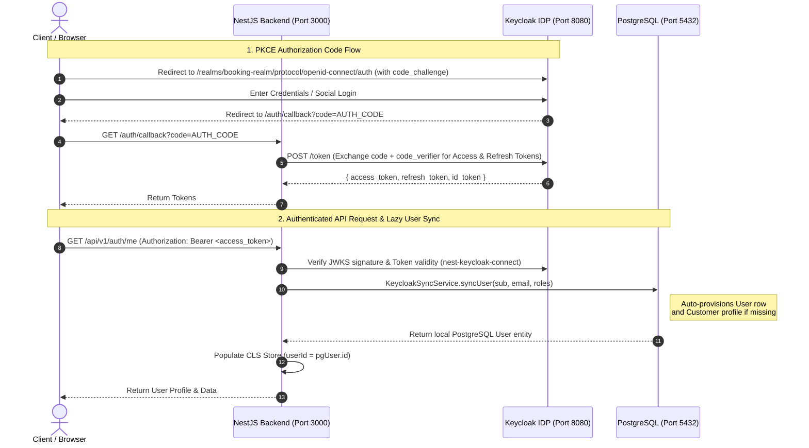

# 🔐 Enterprise Keycloak OIDC Integration & Usage Guide

This document is the definitive technical manual and architectural record for the **Keycloak Identity Provider (IDP)** integration in the Booking System. It details everything implemented across the 6 migration phases, explains the underlying architecture, provides ready-to-use developer workflows, and covers troubleshooting and advanced customizations.

---

## 1. Architectural Overview & Why We Migrated

### Why Migrate from Custom JWT / Bcrypt?
Before this integration, the application relied on a custom authentication system (`AuthService`) that manually hashed passwords with `bcrypt`, issued JWTs via `jsonwebtoken`, and stored refresh tokens in a local `user_tokens` database table. While functional, custom authentication introduces operational friction and security overhead:
* **Maintenance Burden**: Manual handling of email verification, password resets, token rotation, and session expiration.
* **Security Risks**: Storing password hashes locally and writing custom token validation logic increases attack surface.
* **Lack of SSO / Social Login**: Adding OAuth2 providers (Google, Apple, GitHub) or SAML federated logins would require building complex adapters from scratch.

By migrating to **Keycloak**, we offload identity management, credential storage, token rotation, multi-factor authentication (MFA), and session revocation to a hardened, enterprise-grade open-source IAM engine.

### High-Level System Architecture



---

## 2. Phase-by-Phase Implementation Journey

We implemented this system in 6 sequential phases, ensuring zero regression and a clean transition:

### Phase 1: Infrastructure & Containerization
* **Docker Compose Profile**: Added the `keycloak` service to [docker-compose.yml](file:///d:/Mentorship/Booking/Project/Booking-System/docker-compose.yml) under the `auth` (and `fullstack`) profile. Exposed on port `8080`.
* **Realm Export Seed**: Created [keycloak/realm-export.json](file:///d:/Mentorship/Booking/Project/Booking-System/keycloak/realm-export.json). This pre-configures:
  * Realm: `booking-realm`
  * Client: `booking-backend` (Standard Flow + Direct Access Grants enabled, PKCE configured).
  * Roles: `admin` and `customer` realm roles.
  * Admin User: Seeded default user (`admin` / `admin`) with the `admin` role assigned.
* **Database Initialization**: Created [init-keycloak-db.sql](file:///d:/Mentorship/Booking/Project/Booking-System/init-keycloak-db.sql) and mounted it in [Dockerfile.postgres](file:///d:/Mentorship/Booking/Project/Booking-System/Dockerfile.postgres). When Docker Postgres starts, it automatically creates a dedicated `keycloak` database alongside the app database.
* **Environment Configuration**: Replaced legacy JWT/password secrets in `.env` and `.env.example` with standardized Keycloak variables (`KEYCLOAK_URL`, `KEYCLOAK_REALM`, `KEYCLOAK_CLIENT_ID`, `KEYCLOAK_SECRET`).

### Phase 2: NestJS Adapter & Security Guard Architecture
* **Keycloak Module**: Created [keycloak.module.ts](file:///d:/Mentorship/Booking/Project/Booking-System/src/modules/auth/keycloak.module.ts) using `nest-keycloak-connect` and `keycloak-connect`. Features dynamic hostname resolution: when running inside Docker (`DOCKER_ENV=true`), it connects via `http://keycloak:8080`, whereas local host execution connects via `http://localhost:8080`.
* **AuthGuard Refactoring**: Upgraded [auth.guard.ts](file:///d:/Mentorship/Booking/Project/Booking-System/src/common/guards/auth.guard.ts) to extend `KeycloakAuthGuard`. Instead of manually verifying JWT secrets, this guard automatically fetches Keycloak’s JSON Web Key Set (JWKS), caches the public keys, and validates signature, expiration, issuer, and audience.
* **Role Verification**: Upgraded [roles.guard.ts](file:///d:/Mentorship/Booking/Project/Booking-System/src/common/guards/roles.guard.ts) and [admin.guard.ts](file:///d:/Mentorship/Booking/Project/Booking-System/src/common/guards/admin.guard.ts) to evaluate claims directly from `realm_access.roles` in the Keycloak access token.
* **CLS Store Context Integration**: Within `AuthGuard`, after validating the Keycloak token, the system invokes `KeycloakSyncService`, synchronizes the identity with local PostgreSQL, and populates `ClsService` (`user.userId = localPgUser.id`). All downstream repository queries and outbox audit logs seamlessly continue using the local PostgreSQL UUID without code changes!

### Phase 3: User Entity & Lazy Synchronization
* **Entity Evolution**: Modified [user.entity.ts](file:///d:/Mentorship/Booking/Project/Booking-System/src/modules/user/entities/user.entity.ts) to remove the `password` and `isConfirmed` columns. Added a `keycloakId` string column (`UNIQUE NOT NULL`), which maps 1:1 with Keycloak's `sub` claim.
* **Lazy Provisioning Engine**: Created [keycloak-sync.service.ts](file:///d:/Mentorship/Booking/Project/Booking-System/src/modules/auth/services/keycloak-sync.service.ts). Why lazy migration? When a user authenticates via Keycloak for the very first time, this service intercepts their token:
  1. Checks if a local user row exists where `keycloakId === sub`.
  2. If missing, automatically creates a new `User` row in PostgreSQL.
  3. If the Keycloak token contains the `customer` role and no customer profile exists, it automatically creates a corresponding `Customer` profile in PostgreSQL.
* **Clean Slate Schema Migration**: Executed migration `1785638400000-MigrateUsersToKeycloak`. Since only dev seed accounts existed, it performed a clean `TRUNCATE TABLE "users" CASCADE` and altered the schema to enforce `keycloakId`.

### Phase 4: Developer PKCE Login UI
* **EJS View Engine**: Enabled EJS in [main.ts](file:///d:/Mentorship/Booking/Project/Booking-System/src/main.ts) (`app.setViewEngine('ejs')`) and created modern, glassmorphic UI templates in [views/login.ejs](file:///d:/Mentorship/Booking/Project/Booking-System/views/login.ejs) and [views/callback.ejs](file:///d:/Mentorship/Booking/Project/Booking-System/views/callback.ejs).
* **Proof Key for Code Exchange (PKCE)**: Implemented standard OAuth 2.0 PKCE directly in client JavaScript:
  * On page load, generates a random 64-character `code_verifier` and computes its SHA-256 base64url hash (`code_challenge`).
  * Redirects the user to Keycloak with `code_challenge_method=S256` and a random CSRF `state` string.
  * Upon redirect back to `/auth/callback`, posts the authorization code and `code_verifier` to Keycloak's `/token` endpoint, receiving JWT access/refresh tokens.
* **Login Controller**: Created [login.controller.ts](file:///d:/Mentorship/Booking/Project/Booking-System/src/modules/auth/controllers/login.controller.ts) to serve `/login` and `/auth/callback`, excluded from the global `/api/v1` prefix in `main.ts` to ensure clean OAuth redirect URIs.

### Phase 5: Admin User Management REST API
* **Keycloak Admin Service**: Created [keycloak-admin.service.ts](file:///d:/Mentorship/Booking/Project/Booking-System/src/modules/auth/services/keycloak-admin.service.ts) to manage accounts programmatically via Keycloak's Admin REST API.
  * **Auth Strategy**: Uses OAuth2 password grant on the Keycloak `master` realm with the default `admin-cli` client. Caches the system admin token in server memory and automatically refreshes it 30 seconds before expiration or on a `401 Unauthorized` response.
  * **Account Blocking (`blockUser`)**: 
    1. Sends `PUT /admin/realms/booking-realm/users/{id}` with `{ enabled: false }`.
    2. Sends `POST /admin/realms/booking-realm/users/{id}/logout` to instantly revoke all active Keycloak login sessions (existing JWTs stop working immediately).
    3. Updates local PostgreSQL: sets `isActive = false` on the user entity.
  * **Account Activation (`activateUser`)**: Sets `enabled: true` in Keycloak and sets `isActive = true` locally.
* **Admin Controller**: Created [admin.controller.ts](file:///d:/Mentorship/Booking/Project/Booking-System/src/modules/auth/controllers/admin.controller.ts), exposing routes under `/api/v1/admin/users`, protected by both `AuthGuard` (valid token) and `AdminGuard` (`admin` realm role required).

### Phase 6: Complete Cleanup & Dependency Elimination
* **Dropped Legacy Schema**: Created and executed migration `1785638500000-DropUserTokensTable`, permanently dropping the legacy `user_tokens` database table.
* **Code Deletion**: Deleted unused legacy files: `UserTokenService`, `UserTokenRepository`, `user-token.entity.ts`, `password.utils.ts`, `auth.dto.ts`, `token-type.enum.ts`, and legacy `auth.service.ts`.
* **Controller Cleanup**: Refactored [auth.controller.ts](file:///d:/Mentorship/Booking/Project/Booking-System/src/modules/auth/controllers/auth.controller.ts) to retain only active Keycloak session endpoints (`GET /api/v1/auth/me` and local `POST /api/v1/auth/logout`).
* **Dependency Pruning**: Uninstalled `bcrypt`, `@types/bcrypt`, and `jsonwebtoken`. Added `--legacy-peer-deps` to [Dockerfile](file:///d:/Mentorship/Booking/Project/Booking-System/Dockerfile) and created [.npmrc](file:///d:/Mentorship/Booking/Project/Booking-System/.npmrc) to ensure seamless container builds with NestJS 11.

---

## 3. How to Run Keycloak in Local Development & Docker

### Option A: Running Fullstack via Docker Compose (Recommended)
To launch the entire infrastructure (Keycloak, Postgres, NestJS App, ELK Stack, RabbitMQ, Redis) cleanly in Docker:

```bash
docker-compose --profile fullstack up -d --build
```
* **NestJS Application**: http://localhost:3000
* **Swagger API Docs**: http://localhost:3000/api/docs
* **Keycloak Admin UI**: http://localhost:8080
  * Username: `admin` | Password: `admin`
* **Developer Login UI**: http://localhost:3000/login

### Option B: Running Keycloak & Postgres in Docker, NestJS Locally
If you are developing features and want hot-reloading on your host machine:
1. Start only the backend dependencies:
   ```bash
   docker-compose --profile auth up -d
   ```
2. Start the NestJS dev server locally:
   ```bash
   npm run dev
   ```

---

## 4. Developer API & Frontend Usage Guide

### A. Implementing Login in Your Frontend / Mobile App (PKCE Flow)
Never collect passwords directly in your frontend application. Instead, redirect the user to Keycloak using the standard OAuth 2.0 PKCE flow:

```javascript
// Step 1: Generate PKCE Verifier & Challenge
function generateRandomString(length) {
  const charset = 'ABCDEFGHIJKLMNOPQRSTUVWXYZabcdefghijklmnopqrstuvwxyz0123456789-._~';
  let result = '';
  const values = new Uint32Array(length);
  crypto.getRandomValues(values);
  for (let i = 0; i < length; i++) result += charset[values[i] % charset.length];
  return result;
}

async function generateCodeChallenge(verifier) {
  const encoder = new TextEncoder();
  const data = encoder.encode(verifier);
  const digest = await crypto.subtle.digest('SHA-256', data);
  return btoa(String.fromCharCode(...new Uint8Array(digest)))
    .replace(/\+/g, '-').replace(/\//g, '_').replace(/=+$/, '');
}

// Step 2: Redirect User to Keycloak Login Page
const verifier = generateRandomString(64);
sessionStorage.setItem('pkce_verifier', verifier);
const challenge = await generateCodeChallenge(verifier);

const kcUrl = 'http://localhost:8080/realms/booking-realm/protocol/openid-connect/auth';
const params = new URLSearchParams({
  client_id: 'booking-backend',
  response_type: 'code',
  scope: 'openid email profile',
  redirect_uri: 'http://localhost:3000/auth/callback', // Your frontend callback route
  code_challenge: challenge,
  code_challenge_method: 'S256',
  state: generateRandomString(16)
});

window.location.href = `${kcUrl}?${params.toString()}`;
```

When Keycloak redirects back to your callback route with `?code=XYZ`, exchange it for tokens:

```javascript
// Step 3: Exchange Authorization Code for JWTs
const code = new URLSearchParams(window.location.search).get('code');
const verifier = sessionStorage.getItem('pkce_verifier');

const tokenResponse = await fetch('http://localhost:8080/realms/booking-realm/protocol/openid-connect/token', {
  method: 'POST',
  headers: { 'Content-Type': 'application/x-www-form-urlencoded' },
  body: new URLSearchParams({
    grant_type: 'authorization_code',
    client_id: 'booking-backend',
    code: code,
    redirect_uri: 'http://localhost:3000/auth/callback',
    code_verifier: verifier
  })
});

const { access_token, refresh_token, id_token } = await tokenResponse.json();
// Store access_token in memory / localStorage, and refresh_token in HttpOnly cookie
```

### B. Calling Protected NestJS Endpoints
Attach the Keycloak `access_token` as a Bearer header in all HTTP requests:

```javascript
const response = await fetch('http://localhost:3000/api/v1/bookings', {
  headers: {
    'Authorization': `Bearer ${access_token}`,
    'Content-Type': 'application/json'
  }
});
```

### C. Fetching Current User Profile
To get the currently logged-in user's synchronized profile from your NestJS backend:

```http
GET /api/v1/auth/me HTTP/1.1
Host: localhost:3000
Authorization: Bearer <access_token>
```

### D. Implementing User Logout
We provide two logout endpoints to cover both browser SSO session termination and API token cleanup:
1. **Browser SSO Logout (`GET /logout` or `GET /auth/logout`)**: Redirects the user's browser directly to Keycloak's OIDC end-session endpoint. Keycloak wipes the user's SSO session and redirects back to `/auth/callback`, which automatically returns the browser to `/login`.
2. **API Local Logout (`POST /api/v1/auth/logout`)**: Clears legacy/local cookies (`refresh_token`) and returns a JSON 200 confirmation for REST/Postman clients.

---

## 5. Admin User Management Guide

Administrators with the `admin` realm role can manage users programmatically via `/api/v1/admin/users`.

### A. Blocking / Banning a User
When an admin blocks a user, the system immediately disables their Keycloak account, revokes all active login sessions across all devices, and sets `isActive = false` in local PostgreSQL.

```http
PATCH /api/v1/admin/users/8372b0d1-c22b-4301-ab97-bd39dba4754f/block HTTP/1.1
Host: localhost:3000
Authorization: Bearer <admin_access_token>
```
**Response (200 OK)**:
```json
{
  "message": "User blocked and all sessions revoked"
}
```

### B. Re-Activating a User
```http
PATCH /api/v1/admin/users/8372b0d1-c22b-4301-ab97-bd39dba4754f/activate HTTP/1.1
Host: localhost:3000
Authorization: Bearer <admin_access_token>
```

### C. Inspecting Keycloak User Profile
```http
GET /api/v1/admin/users/8372b0d1-c22b-4301-ab97-bd39dba4754f HTTP/1.1
Host: localhost:3000
Authorization: Bearer <admin_access_token>
```

---

## 6. Adding Social Login (Google, GitHub, Apple) — Zero Code Required!

One of the greatest benefits of this architecture is that adding social login requires **zero changes** to our NestJS backend code.

### Step-by-Step Guide to Enable Google Login:
1. Open the Keycloak Admin Console at `http://localhost:8080`.
2. Select the `booking-realm` from the top-left dropdown.
3. In the left sidebar, click **Identity Providers**.
4. Click **Google** (or GitHub / Microsoft / Apple).
5. Enter your **Client ID** and **Client Secret** (obtained from your Google Cloud Console OAuth credentials).
6. Copy the **Redirect URI** shown in Keycloak and paste it into your Google Cloud Console allowed redirect URIs.
7. Click **Save**.

**That's it!** The next time a user visits the Keycloak login page, a **"Login with Google"** button will appear automatically. When they log in via Google, Keycloak issues a standard JWT to our backend, and our `KeycloakSyncService` auto-provisions their PostgreSQL account seamlessly.

---

## 7. Troubleshooting & Common Gotchas

### A. Docker Container Hostname Routing (`DOCKER_ENV=true`)
* **Symptom**: `ECONNREFUSED 127.0.0.1:8080` when NestJS tries to fetch Keycloak JWKS inside Docker.
* **Solution**: Inside a Docker container, `localhost` refers to the container itself, not Keycloak. Our `docker-compose.yml` sets `DOCKER_ENV=true` on the `node-app` container. In `keycloak.module.ts` and `keycloak-admin.service.ts`, the code detects this flag and automatically switches to `KEYCLOAK_INTERNAL_URL=http://keycloak:8080`.

### B. NestJS 11 vs. Third-Party Peer Dependencies
* **Symptom**: `npm ci` fails with `ERESOLVE could not resolve peer @nestjs/common@">=6.0.0 <11.0.0" from nest-keycloak-connect`.
* **Solution**: We created a `.npmrc` file in the project root containing `legacy-peer-deps=true` and updated [Dockerfile](file:///d:/Mentorship/Booking/Project/Booking-System/Dockerfile) to pass `--legacy-peer-deps` to all `npm ci` commands.

### C. Restricting Bearer-Only Access vs. gRPC
* **Question**: Does setting `bearerOnly: true` in Keycloak interfere with backend gRPC communication?
* **Answer**: No. `bearerOnly: true` in Keycloak tells the IDP that the client (`booking-backend`) will never initiate interactive browser login redirects directly from server routes; it only accepts existing Bearer tokens. This applies strictly to HTTP REST requests entering via guards. Your internal microservice communication over gRPC is decoupled from Keycloak's HTTP bearer evaluation.

### D. Order of Operations When Truncating / Migrating Users
* **Rule**: Whenever running database migrations that wipe or truncate user tables in staging or production, **always ensure your admin account exists in Keycloak first**. On the very first request made with your Keycloak JWT after a database wipe, `KeycloakSyncService` will instantly re-create your local PostgreSQL user row and restore your access.

### E. SanitizePipe Crashing on Primitive Query Parameters (`Cannot read properties of undefined (reading '__proto__')`)
* **Symptom**: `500 Internal Server Error` when `/auth/callback` or endpoints with primitive query parameters (`@Query('error')`) are called.
* **Cause**: `class-sanitizer` trying to inspect `__proto__` of simple primitive strings or `undefined` values when decorators record the metadata type as `String`.
* **Solution**: Updated `SanitizePipe.transform` in [sanitize.pipe.ts](file:///d:/Mentorship/Booking/Project/Booking-System/src/common/sanitize/sanitize.pipe.ts) to check if the value is primitive/built-in (`String`, `Number`, `Boolean`, `Array`, `Object`) or empty/not an object, returning it as-is without passing it to `sanitize()`.

### F. Keycloak Logout Saying "We are sorry... Invalid redirect uri / Invalid url"
* **Symptom**: Keycloak showing an error page when redirecting to OIDC logout with a custom `post_logout_redirect_uri`.
* **Cause**: Keycloak strictly requires `post_logout_redirect_uri` to match an existing whitelist entry in the realm's client configuration in its PostgreSQL database. When running inside Docker on an existing database volume, edits to local JSON files are not automatically re-imported.
* **Solution**: Configured `LoginController.logout` in [login.controller.ts](file:///d:/Mentorship/Booking/Project/Booking-System/src/modules/auth/controllers/login.controller.ts) to use `/auth/callback` as the `post_logout_redirect_uri` (which is pre-whitelisted in the database), and configured [callback.ejs](file:///d:/Mentorship/Booking/Project/Booking-System/views/callback.ejs) to automatically redirect to `/login` whenever it loads without an authorization code.

### G. Missing Keycloak Container Logs in Docker Compose (`--profile fullstack`)
* **Symptom**: Keycloak container logs do not appear in the terminal console when starting `docker-compose --profile fullstack up`.
* **Cause**: In [docker-compose.yml](file:///d:/Mentorship/Booking/Project/Booking-System/docker-compose.yml), the `keycloak` service was assigned only to `profiles: [auth]`. When launching `--profile fullstack`, containers assigned exclusively to other profiles are not streamed.
* **Solution**: Added `fullstack` to Keycloak's profile list (`profiles: [auth, fullstack]`) and added `keycloak` under `node-app`'s `depends_on` block so its logs stream live alongside the NestJS application.
