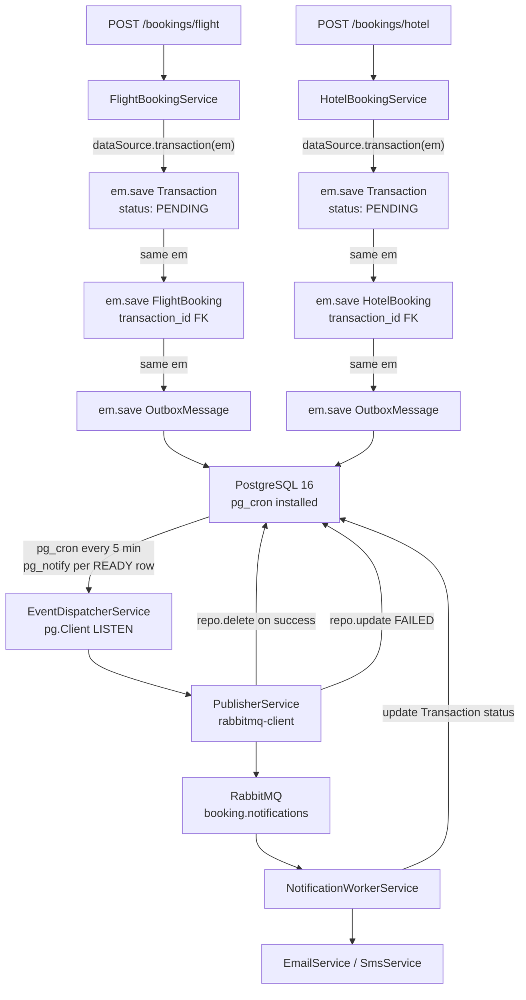
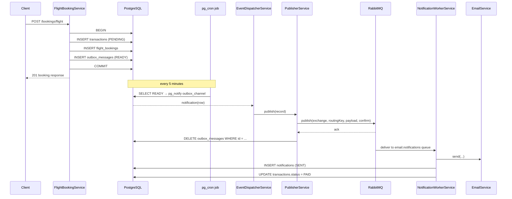

# Booking System — Outbox Pattern Implementation Plan

> Event-driven notification system using the **Outbox Pattern** with **PostgreSQL 16 + pg_cron**, **RabbitMQ**, **TypeORM**, and a NestJS worker — all inside the existing modular monolith.

---

## Table of contents

1. [Goals](#1-goals)
2. [Architecture overview](#2-architecture-overview)
3. [Why this design](#3-why-this-design)
4. [Database schema](#4-database-schema)
5. [Project file structure](#5-project-file-structure)
6. [Component responsibilities](#6-component-responsibilities)
7. [End-to-end flow](#7-end-to-end-flow)
8. [TypeORM vs raw SQL — what is used where](#8-typeorm-vs-raw-sql--what-is-used-where)
9. [Environment variables](#9-environment-variables)
10. [How to run](#10-how-to-run)
11. [How to verify the system](#11-how-to-verify-the-system)
12. [Operations & troubleshooting](#12-operations--troubleshooting)

---

## 1. Goals

- Persist a **payment Transaction**, a **booking** (flight or hotel), and an **outbox event** **atomically** in one DB transaction.
- Reliably deliver each event to **RabbitMQ**, even if the app or broker crashes between steps.
- A **NestJS worker** consumes the events and sends **Email** / **SMS** notifications, updating the transaction status to `PAID` / `FAILED`.
- Use **TypeORM** for all domain CRUD. Drop down to **raw pg client** only where unavoidable (LISTEN/NOTIFY).
- Replace ad-hoc app polling with **`pg_cron`** running inside PostgreSQL.

---

## 2. Architecture overview



---

## 3. Why this design

| Concern | Choice | Reasoning |
|---------|--------|-----------|
| Atomicity of booking + event | **TypeORM `dataSource.transaction(em => ...)`** | Single SQL transaction — DB rollback wipes all 3 rows if any step fails |
| Schedule the dispatch | **`pg_cron` inside Postgres** | Schedule survives NestJS restarts; no app-level `@Interval`/`setInterval` |
| Notify the app instantly | **`pg_notify('outbox_channel', row)`** + NestJS **`LISTEN`** | Sub-second latency once the cron tick fires |
| LISTEN connection | **Raw `pg.Client`** (not TypeORM) | LISTEN requires a dedicated persistent connection; TypeORM's pool is incompatible |
| RabbitMQ I/O | **`rabbitmq-client`** with `confirm: true` | Waits for broker ACK before the publisher marks the row "done" |
| On publish success | **DELETE outbox row** | Smallest possible outbox table; easy to inspect |
| On publish failure | **UPDATE status = `FAILED`, failed_at = NOW()** | Easy to retry by flipping it back to `READY` |
| Notification side | **NestJS consumer in the same monolith** | No microservice split; same process, separate concern |

---

## 4. Database schema

> Created automatically by `docker/postgres/init/02-tables.sql` on first Postgres boot.

### `transactions`
| Column | Type | Notes |
|--------|------|-------|
| `id` | UUID PK | `uuid_generate_v4()` |
| `user_id` | UUID NOT NULL | |
| `amount` | NUMERIC(10,2) NOT NULL | |
| `currency` | VARCHAR(10) | default `'USD'` |
| `payment_method` | VARCHAR(50) | `CREDIT_CARD` / `DEBIT_CARD` / `PAYPAL` |
| `status` | VARCHAR(50) | `PENDING` / `PAID` / `FAILED` / `REFUNDED` |
| `created_at` / `updated_at` | TIMESTAMP | |

### `flight_bookings` and `hotel_bookings`
Both have `transaction_id UUID NOT NULL UNIQUE REFERENCES transactions(id)` (1-to-1) plus booking-specific columns:
- Flight: `origin`, `destination`, `departure_date`, `cabin_class`, `adults_count`, `total_price`, `currency`, `status`
- Hotel: `hotel_id`, `check_in`, `check_out`, `room_type`, `guests_count`, `total_price`, `currency`, `status`

### `outbox_messages`
| Column | Type | Notes |
|--------|------|-------|
| `id` | UUID PK | |
| `exchange_name` | VARCHAR(255) | RabbitMQ exchange |
| `routing_key` | VARCHAR(255) | RabbitMQ routing key |
| `payload` | JSONB NOT NULL | Carries `transactionId` for correlation |
| `status` | VARCHAR(50) | `READY` (default) / `FAILED` |
| `failed_at` | TIMESTAMP NULL | |
| `created_at` | TIMESTAMP | |

### `notifications`
| Column | Type | Notes |
|--------|------|-------|
| `id` | UUID PK | |
| `transaction_id` | UUID NULL | |
| `type` | VARCHAR(20) | `EMAIL` / `SMS` |
| `recipient` | VARCHAR(255) | |
| `subject` / `content` | TEXT | |
| `status` | VARCHAR(50) | `PENDING` / `SENT` / `FAILED` |
| `error` | TEXT NULL | |
| `created_at` / `sent_at` | TIMESTAMP | |

### `pg_cron` job (in `03-pg-cron.sql`)
```sql
SELECT cron.schedule(
  'outbox-relay',
  '*/5 * * * *',
  $job$
    DO $body$ DECLARE rec RECORD;
    BEGIN
      FOR rec IN SELECT * FROM outbox_messages WHERE status = 'READY' ORDER BY created_at ASC
      LOOP
        PERFORM pg_notify('outbox_channel', row_to_json(rec)::text);
      END LOOP;
    END; $body$;
  $job$
);
```

---

## 5. Project file structure

```text
docker/postgres/
├── Dockerfile                                   ← postgres:16 + pg_cron
└── init/
    ├── 01-extensions.sql                        ← pg_cron, uuid-ossp
    ├── 02-tables.sql                            ← all tables
    └── 03-pg-cron.sql                           ← cron job

src/
├── common/
│   ├── cache/                                   (existing — Redis)
│   └── database/
│       └── database.module.ts                   ← TypeORM global config
└── modules/
    ├── transactions/
    │   ├── entities/transaction.entity.ts
    │   ├── transactions.service.ts
    │   └── transactions.module.ts
    ├── bookings/
    │   ├── entities/
    │   │   ├── flight-booking.entity.ts
    │   │   └── hotel-booking.entity.ts
    │   ├── dto/
    │   │   ├── create-flight-booking.dto.ts
    │   │   └── create-hotel-booking.dto.ts
    │   ├── flight-booking.service.ts            ← 3-record TypeORM transaction
    │   ├── hotel-booking.service.ts
    │   ├── bookings.controller.ts               ← POST /bookings/flight & /bookings/hotel
    │   └── bookings.module.ts
    ├── outbox/
    │   ├── entities/outbox-message.entity.ts
    │   ├── outbox.constants.ts                  ← DI tokens
    │   ├── outbox.service.ts                    ← writeEvent(em, ...)
    │   ├── publisher.service.ts                 ← rabbitmq-client + repo
    │   ├── event-dispatcher.service.ts          ← pg.Client LISTEN
    │   └── outbox.module.ts                     ← @Global
    └── notifications/
        ├── entities/notification.entity.ts
        ├── email/email.service.ts               ← nodemailer
        ├── sms/sms.service.ts                   ← stub
        ├── worker/notification-worker.service.ts ← rabbitmq-client consumer
        ├── notifications.service.ts
        └── notifications.module.ts
```

---

## 6. Component responsibilities

### `DatabaseModule`
- Provides the global TypeORM connection.
- `synchronize: false` — schema is owned by the SQL init scripts.

### `TransactionsService`
- `createWithEntityManager(em, input)` — saves a PENDING transaction inside the caller's transaction.
- `updateStatus(id, status)` — used by the worker to flip to `PAID` / `FAILED`.

### `OutboxService`
- `writeEvent(em, { exchangeName, routingKey, payload })` — inserts an `OutboxMessage` with status `READY`. Must be called inside `dataSource.transaction(em => ...)` so the row commits with the business rows.

### `PublisherService`
- Consumes outbox records produced by `EventDispatcherService`.
- Uses `rabbitmq-client.createPublisher({ confirm: true })`.
- On success: `outboxRepo.delete({ id })`.
- On failure: `outboxRepo.update({ id }, { status: 'FAILED', failedAt: new Date() })`.

### `EventDispatcherService`
- Owns a long-lived `pg.Client` (NOT TypeORM pool — required for LISTEN).
- `onModuleInit`: connect → `processBootstrapMessages()` → `LISTEN outbox_channel` → register notification handler.
- `processBootstrapMessages()` covers the small window where pg_cron has not yet fired since the last restart.

### `FlightBookingService` / `HotelBookingService`
Each `create(dto)` runs all of this inside one `dataSource.transaction(em => ...)`:
1. `transactionsService.createWithEntityManager(em, ...)` → Transaction (PENDING)
2. `em.save(FlightBooking | HotelBooking, { transactionId: txn.id, ... })`
3. `outboxService.writeEvent(em, { exchangeName, routingKey, payload: { transactionId, ... } })`

If any step throws, all three rows roll back together. No orphan outbox messages, ever.

### `NotificationWorkerService`
- `onModuleInit`: creates two consumers — one for `email.notifications`, one for `sms.notifications` — with `prefetchCount: 10`.
- Declares the exchange/queues/bindings idempotently (`durable: true`).
- For each message:
  - Calls `EmailService.send()` or `SmsService.send()`.
  - Inserts a `Notification` row with `SENT` / `FAILED`.
  - Updates `Transaction.status` to `PAID` (success) or `FAILED`.
  - Throws on failure so `rabbitmq-client` nacks the message and retries.

### `EmailService` / `SmsService`
- `EmailService` uses `nodemailer.createTransport(...)`. If SMTP env vars are not set it logs `[EMAIL STUB]` instead of sending.
- `SmsService` is a stub that logs `[SMS STUB]`. Replace with Twilio when ready.

---

## 7. End-to-end flow



---

## 8. TypeORM vs raw SQL — what is used where

| Operation | Approach | Reason |
|-----------|----------|--------|
| Transaction INSERT | TypeORM `em.save()` | Standard CRUD inside transaction |
| FlightBooking / HotelBooking INSERT | TypeORM `em.save()` | Standard CRUD inside transaction |
| OutboxMessage INSERT | TypeORM `em.save(em, OutboxMessage)` | Standard CRUD inside transaction |
| OutboxMessage DELETE on success | TypeORM `repo.delete()` | Standard CRUD |
| OutboxMessage UPDATE to FAILED | TypeORM `repo.update()` | Standard CRUD |
| Transaction status update | TypeORM `repo.update()` | Standard CRUD |
| Notification INSERT | TypeORM `repo.save()` | Standard CRUD |
| LISTEN `outbox_channel` | **Raw `pg.Client`** | TypeORM's pool can't hold a persistent LISTEN connection |
| pg_cron job registration | SQL file at init time | pg_cron has no TypeORM/ORM support |

---

## 9. Environment variables

Added in `.env` and `.env.example`:

```env
# ─── Email (SMTP) ───
SMTP_HOST=
SMTP_PORT=587
SMTP_USER=
SMTP_PASS=
SMTP_FROM=

# ─── SMS (Twilio stub) ───
SMS_ACCOUNT_SID=
SMS_AUTH_TOKEN=
SMS_FROM_NUMBER=
```

Existing vars still in use:
- `DATABASE_URL`, `DATABASE_USER`, `DATABASE_PASSWORD`, `DATABASE_NAME`, `DATABASE_LOCAL_PORT`
- `RABBITMQ_URL`, `RABBITMQ_USER`, `RABBITMQ_PASSWORD`
- `REDIS_URL`, `CACHE_TTL`
- `PORT`

---

## 10. How to run

> The Postgres image was rebuilt — wipe the old volume so `pg_cron` is installed in a fresh DB.

```powershell
docker compose down -v
docker compose up -d --build redis postgres rabbitmq
npm run dev
```

Endpoints:
- `POST http://localhost:3000/api/v1/bookings/flight`
- `POST http://localhost:3000/api/v1/bookings/hotel`
- Swagger: `http://localhost:3000/api-docs`
- RabbitMQ UI: `http://localhost:15672` (`booking` / `booking`)

---

## 11. How to verify the system

### 1. Create a booking
```powershell
Invoke-RestMethod -Uri "http://localhost:3000/api/v1/bookings/flight" -Method Post -ContentType "application/json" -Body (@{
  userId="00000000-0000-0000-0000-000000000001";
  userEmail="test@example.com";
  origin="LHR"; destination="JFK"; departureDate="2026-06-01";
  cabinClass="ECONOMY"; adultsCount=1; totalPrice=750.5; currency="USD";
  paymentMethod="CREDIT_CARD"
} | ConvertTo-Json)
```

### 2. Inspect the database
```powershell
docker exec -it booking_postgres psql -U booking -d booking -c "SELECT id, status FROM transactions ORDER BY created_at DESC LIMIT 5;"
docker exec -it booking_postgres psql -U booking -d booking -c "SELECT id, transaction_id, status FROM flight_bookings ORDER BY created_at DESC LIMIT 5;"
docker exec -it booking_postgres psql -U booking -d booking -c "SELECT id, status, created_at FROM outbox_messages ORDER BY created_at DESC LIMIT 5;"
```

### 3. Watch the cron tick (up to 5 minutes)
After the next tick, the dispatcher logs:
```
Dispatching outbox record [<uuid>]
Published and deleted outbox record [<uuid>]
```

The worker logs:
```
[EMAIL STUB] to=test@example.com subject="Flight booking confirmation (LHR → JFK)"
```

The `outbox_messages` row is **gone**. The `notifications` row is `SENT`. The `transactions.status` is `PAID`.

### 4. Inspect pg_cron history
```sql
SELECT * FROM cron.job;
SELECT * FROM cron.job_run_details ORDER BY start_time DESC LIMIT 10;
```

---

## 12. Operations & troubleshooting

### Retry FAILED outbox messages
```sql
UPDATE outbox_messages SET status = 'READY', failed_at = NULL WHERE status = 'FAILED';
```
pg_cron will pick them up on the next tick.

### Change the schedule
```sql
SELECT cron.alter_job(
  job_id := (SELECT jobid FROM cron.job WHERE jobname = 'outbox-relay'),
  schedule := '* * * * *'   -- every minute
);
```

### Re-trigger immediately (without waiting for the cron tick)
```sql
SELECT pg_notify('outbox_channel', row_to_json(o)::text)
FROM outbox_messages o WHERE o.status = 'READY';
```

### Common pitfalls
| Symptom | Likely cause |
|--------|--------------|
| `pg_cron` jobs do not run | `shared_preload_libraries=pg_cron` not set on the postgres `command:` or `cron.database_name` not set |
| `cron extension not found` | Custom `docker/postgres/Dockerfile` was not rebuilt — run `docker compose up -d --build postgres` |
| Outbox row stays `READY` forever | `EventDispatcherService.onModuleInit` failed to connect — check NestJS logs |
| Messages re-process forever | Worker is throwing before delete — check `EmailService` / `SmsService` logs |
| Wrong port collision on `5432`/`5433` | Old `postgres-db` container holding the port — `docker rm` it |

---

## Done.
Five modules wired into the same monolith, three-row atomicity via TypeORM, pg_cron + LISTEN/NOTIFY for delivery, and a worker that closes the loop on both notifications and transaction status.
