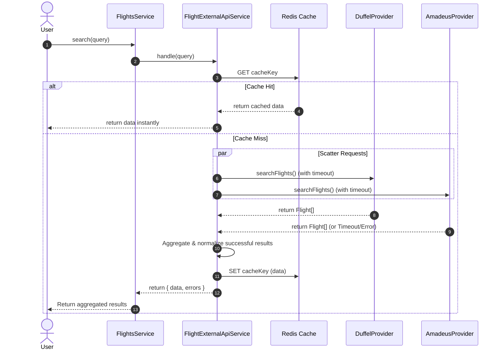

# End-to-End Search and Booking Flow

This document provides a comprehensive overview of exactly what happens when a user performs a search and subsequently creates a booking. It traces the logic through all the architectural layers: **Controllers, Services, External API, Providers, Cache, Transactions, and the Outbox Module**.

---

## 1. The Search Flow (Scatter-Gather & Caching)

When a user searches for a flight (or hotel), the goal of the system is to aggregate results from multiple 3rd-party providers (like Duffel, Amadeus, etc.) as fast as possible, while handling failures gracefully.

### How it works:
1. **Request**: The user hits `GET /flights?origin=LHR...`
2. **Controller**: `FlightsController` validates the query parameters using DTOs and passes them to `FlightsService`.
3. **Delegation**: `FlightsService` doesn't do the searching itself. It delegates to the `FlightExternalApiService`.
4. **Caching**: `FlightExternalApiService` checks Redis via `CacheService`. If the exact search exists, it returns immediately (Cache Hit).
5. **Scatter-Gather (Cache Miss)**: 
   - It fires off requests to *all* registered providers simultaneously (`Promise.allSettled`).
   - A strict timeout is enforced (`withTimeout`). If a provider is too slow, it's treated as a failure but doesn't block the other successful providers.
6. **Aggregation**: The results are combined into a unified array, cached in Redis for future identical searches, and returned to the user.

### Sequence Diagram: External API (Search)

---

## 2. The Booking Flow (Transactions & Event-Driven Outbox)

When a user decides to book one of the returned flights, the system must guarantee that the financial ledger, the booking record, and the notification emails are all perfectly synchronized.

### How it works:
1. **Request**: The user hits `POST /flights` with booking details.
2. **Database Transaction**: `FlightsService` starts a PostgreSQL transaction (`this.dataSource.transaction(em)`).
3. **Financial Ledger**: It calls `TransactionsService` passing the active `EntityManager` (`em`). A `Transaction` entity (status `PENDING`) is created.
4. **Domain Booking**: It creates the actual `FlightBooking` entity, linking it to the `Transaction.id`.
5. **Outbox Event**: It calls `OutboxService.writeEvent` (passing `em`), which saves a JSON payload meant for an email to the `outbox_messages` table.
6. **Commit**: The PostgreSQL transaction commits. At this point, the ledger, booking, and outbox event are firmly in the database.
7. **Postgres Notify**: A trigger on the database fires `pg_notify('outbox_channel', ...)` because a new row was added to the outbox.
8. **Dispatch**: The `EventDispatcherService` (which is always listening via `LISTEN outbox_channel`) receives the notification and passes the ID to the `PublisherService`.
9. **Publish**: `PublisherService` sends the payload to RabbitMQ and marks the database row as `PROCESSED`.
10. **Consume**: The `Notifications Module` consumes the RabbitMQ message and sends the actual email via `nodemailer`.

### Sequence Diagram: The Outbox Pattern & Booking Flow

```mermaid
sequenceDiagram
    autonumber
    actor User
    participant FS as FlightsService
    participant DB as PostgreSQL (DB)
    participant OutboxService as OutboxService
    participant Dispatcher as EventDispatcher
    participant Publisher as PublisherService
    participant RMQ as RabbitMQ
    participant Notif as NotificationsModule

    User->>FS: createBooking(dto)
    
    note over FS, DB: START PostgreSQL Transaction (em)
    
    FS->>DB: INSERT INTO transactions (via TransactionsService)
    FS->>DB: INSERT INTO flight_bookings
    
    FS->>OutboxService: writeEvent(em, payload)
    OutboxService->>DB: INSERT INTO outbox_messages
    
    note over FS, DB: COMMIT PostgreSQL Transaction
    FS-->>User: 201 Booking Initiated
    
    %% Asynchronous Outbox Flow begins here
    rect rgb(30, 41, 59)
    note right of DB: Async Outbox Processing
    DB->>Dispatcher: pg_notify('outbox_channel') trigger fires
    Dispatcher->>Publisher: publishRecord(payload)
    
    Publisher->>RMQ: Publish to 'booking.notifications' exchange
    Publisher->>DB: UPDATE outbox_messages SET status='PROCESSED'
    
    RMQ->>Notif: Deliver message to queue
    Notif->>Notif: Send Email via nodemailer
    end
```

