# Flights Module Sequence & Transaction Flow

This document explains the flow of the `FlightsModule` and clarifies the confusion around the term "transaction" in the codebase.

## Clarifying the "Transaction" Confusion

It's completely normal to be confused here because the word **"transaction"** is being used for two entirely different things:

1. **Database Transaction (`this.dataSource.transaction`)**:
   This is a standard relational database transaction (ACID). It ensures that a group of database operations either all succeed together or all fail together. If an error occurs halfway through, everything is rolled back.

2. **Financial/Business Transaction (`TransactionsService`)**:
   This is a business entity in your system—like a receipt, a payment ledger entry, or an order ID. It represents a user's intent to pay for something.

### What `createBooking` is actually doing:
When you look at this code:
```typescript
return this.dataSource.transaction(async (em) => {
  const transaction = await this.transactionsService.createWithEntityManager(em, ...);
  // ...
});
```

**It is NOT creating two database transactions.**
Instead, it works like this:
1. `this.dataSource.transaction(async (em) => ...)`: Starts the **one and only Database Transaction**. It gives you an `EntityManager` (the `em` variable) which is specifically tied to this active database transaction.
2. `this.transactionsService.createWithEntityManager(em, ...)`: This takes that active `EntityManager` (`em`) and uses it to save a new row into the `transactions` database table (representing the financial ledger entry). Because it uses the `em` you passed it, the row is inserted as part of the overarching database transaction!

## Sequence Diagram

Here is a sequence diagram visualizing how a flight search and booking flows through the system, interacting with the External API, Providers, and the Transactions module.

```mermaid
sequenceDiagram
    autonumber
    actor User
    participant Controller as FlightsController
    participant Service as FlightsService
    participant ExtAPI as FlightExternalApiService
    participant Provider as DuffelFlightProvider (etc)
    participant DB as PostgreSQL Database
    participant Outbox as OutboxService

    %% Search Flow
    rect rgb(30, 41, 59)
    note right of User: Phase 1: Search Flights
    User->>Controller: GET /flights?origin=...
    Controller->>Service: search(query)
    Service->>ExtAPI: handle(query)
    ExtAPI->>Provider: fetch provider flights
    Provider-->>ExtAPI: return raw flight data
    ExtAPI-->>Service: aggregated Flight[]
    Service-->>Controller: Return results to user
    Controller-->>User: JSON response
    end

    %% Booking Flow
    rect rgb(15, 23, 42)
    note right of User: Phase 2: Create Booking
    User->>Controller: POST /flights (CreateFlightBookingDto)
    Controller->>Service: createBooking(dto)
    
    note over Service, DB: START Database Transaction (this.dataSource.transaction)
    
    Service->>Service: TransactionsService.createWithEntityManager(em)
    Service->>DB: INSERT INTO transactions (status: PENDING)
    DB-->>Service: Financial Transaction Entity returned
    
    Service->>DB: INSERT INTO flight_bookings
    DB-->>Service: FlightBooking Entity returned
    
    Service->>Outbox: writeEvent(em, payload)
    Outbox->>DB: INSERT INTO outbox_messages
    
    note over Service, DB: COMMIT Database Transaction
    
    Service-->>Controller: Return { transactionId, bookingId }
    Controller-->>User: 201 Created
    end
```


