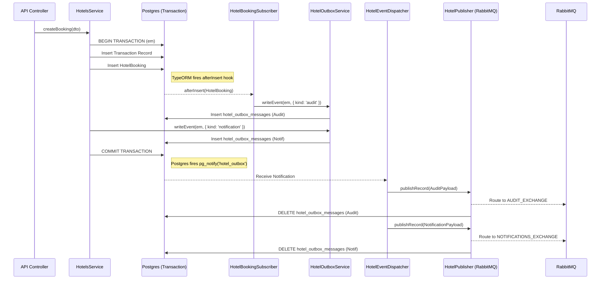

# Hotel Module Architecture

This document serves as a blueprint for the modular monolith architecture used in this project. It explains the transaction boundaries, the isolated outbox pattern, and the entity subscriber pattern used to enforce clean separation of concerns.

## 1. Core Principles

- **Self-Contained Infrastructure:** The Hotel module owns its own outbox tables, its own Postgres LISTEN connections, and its own RabbitMQ publisher. It does not share a global "Outbox" module.
- **Implicit Auditing:** Business logic (the `HotelsService`) does not explicitly write audit logs. Instead, TypeORM `EntitySubscribers` listen for database changes and automatically write audit events within the same database transaction.
- **Transactional Guarantees:** A hotel booking, its payment transaction, and its outbox events (both audit and notification) are saved to the Postgres database within a **single transaction**. If any part fails, nothing is saved.

## 2. Component Responsibilities

| Component | Responsibility |
|---|---|
| `HotelsService` | The primary business logic. Opens the database transaction, creates the transaction record, creates the `HotelBooking` entity, and explicitly requests Notification events. |
| `HotelBookingSubscriber` | A TypeORM interceptor. Pauses the transaction immediately after `HotelBooking` is inserted, generates an `AuditPayload`, and writes it to the outbox table. |
| `HotelOutboxService` | A simple repository wrapper that saves payloads into the `hotel_outbox_messages` table within the provided transaction. |
| `HotelEventDispatcherService` | A background worker that maintains a persistent `LISTEN hotel_outbox` connection to Postgres. It catches real-time `pg_notify` triggers and also schedules a 5-minute fallback `pg_cron` job to sweep for missed messages. |
| `HotelPublisherService` | A dedicated RabbitMQ connection. It receives messages from the dispatcher, routes them based on `payload.kind` (e.g., `audit` vs `notification`), and deletes the Postgres outbox row upon successful RabbitMQ delivery. |

## 3. Sequence Diagram: Creating a Booking

The following sequence diagram illustrates the flow of a booking creation from the initial API call to the final RabbitMQ delivery.



## 4. The Outbox Payload Contract

Because the Hotel module is decoupled from the consumers (Audit Module, Notifications Module), it uses structural typing. The Outbox tables do not store static routing keys. Instead, the `HotelPublisherService` infers the destination based on the `kind` property of the payload.

```typescript
// The generic outbox signature guarantees it accepts only valid schemas
writeEvent<T extends { kind: string }>(em: EntityManager, payload: T)
```

Producers (like `HotelsService`) import the explicit payload types (`AuditPayload`, `NotificationPayload`) from the consumer modules. This ensures strict type safety at compile time, while leaving the infrastructure completely generic.

## 5. Failure & Retry Safety Nets

What happens if RabbitMQ crashes right as a booking is made?

1. The transaction commits successfully. The booking is confirmed.
2. The `HotelEventDispatcherService` tries to send the message to RabbitMQ but fails.
3. The row remains in `hotel_outbox_messages` with `status = 'READY'`.
4. A Postgres `pg_cron` job (`hotel-outbox-relay`) fires every 5 minutes. It selects all `READY` rows and triggers a `pg_notify`.
5. The dispatcher catches the retry notification and pushes the messages to RabbitMQ once it recovers.

This guarantees **At-Least-Once Delivery** without blocking the user's API request.

## 6. Blueprint for Refactoring Other Modules

If you are tasked with bringing another module (e.g., `Flights`, `Cars`, `Flats`) up to this standard, follow these steps:

1. **Delete manual audit writes:** Remove explicit `audit` writes from the main Service.
2. **Create a Subscriber:** Implement an `EntitySubscriberInterface` for the module's primary entity (e.g., `FlightBookingSubscriber`).
3. **Capture Context:** Inject `ClsService` into the subscriber to retrieve the `userId` of the actor performing the action.
4. **Hook into Outbox:** Inside the `afterInsert` / `afterUpdate` hooks, construct the `AuditPayload` and pass it to the module's localized Outbox Service using the `EntityManager` provided by the event.
