# Outbox Module Explanation

This document provides a detailed breakdown of the booking system's Outbox mechanism, located in the [src/modules/outbox](file:///d:/Mentorship/Booking/Project/Booking-System/src/modules/outbox) directory. It explains the design patterns (Transactional Outbox), code syntax, logical flow, and PostgreSQL/RabbitMQ integration.

---

## 1. Directory Structure and Files

The module is composed of the following files:

1.  **[entities/outbox-message.entity.ts](file:///d:/Mentorship/Booking/Project/Booking-System/src/modules/outbox/entities/outbox-message.entity.ts)**: Defines the database schema for the outbox table.
2.  **[outbox.service.ts](file:///d:/Mentorship/Booking/Project/Booking-System/src/modules/outbox/outbox.service.ts)**: Provides a simple method to write an event to the outbox within a database transaction.
3.  **[event-dispatcher.service.ts](file:///d:/Mentorship/Booking/Project/Booking-System/src/modules/outbox/event-dispatcher.service.ts)**: Listens for PostgreSQL notifications (`LISTEN outbox_channel`) and processes existing records on startup.
4.  **[publisher.service.ts](file:///d:/Mentorship/Booking/Project/Booking-System/src/modules/outbox/publisher.service.ts)**: Handles the connection to RabbitMQ, publishes messages, and updates or deletes the database record based on success/failure.
5.  **[outbox.module.ts](file:///d:/Mentorship/Booking/Project/Booking-System/src/modules/outbox/outbox.module.ts)**: The NestJS module that registers all these services.

---

## 2. File-by-File Explanation

### A. The Entity (`outbox-message.entity.ts`)
This file defines the `outbox_messages` table, which temporarily stores events before they are sent to the message broker.

```typescript
@Entity('outbox_messages')
export class OutboxMessage {
  // ...
  @Column({ type: 'varchar', length: 255, name: 'exchange_name' })
  exchangeName: string;

  @Column({ type: 'jsonb' })
  payload: any;

  @Column({ type: 'varchar', length: 50, default: OutboxStatus.READY })
  status: string;
}
```
*   **Purpose**: Stores the `exchangeName`, `routingKey`, and the actual `payload` to be sent.
*   **Status**: Defaults to `READY`. If it fails to publish later, it will be marked as `FAILED`.

---

### B. The Outbox Service (`outbox.service.ts`)
This service exposes a single method to write the event to the database.

```typescript
export class OutboxService {
  writeEvent(
    em: EntityManager,
    input: { exchangeName: string; routingKey: string; payload: any; }
  ): Promise<OutboxMessage> {
    const message = em.create(OutboxMessage, input);
    return em.save(OutboxMessage, message);
  }
}
```
*   **Transaction Context**: Notice it accepts an `EntityManager` (`em`). This is crucial because `writeEvent` must be executed **within the same transaction** as the primary business logic (e.g., creating a Booking). If the business transaction fails, the outbox insert is rolled back alongside it, preventing phantom messages.

---

### C. The Event Dispatcher (`event-dispatcher.service.ts`)
This service is the bridge between PostgreSQL and our Node.js app. It uses raw PostgreSQL connections to listen for database triggers.

```typescript
export class EventDispatcherService implements OnModuleInit {
  async onModuleInit() {
    this.queryRunner = this.dataSource.createQueryRunner();
    await this.queryRunner.connect();
    const pgClient = (this.queryRunner as any).databaseConnection;

    pgClient.on('notification', async (msg) => {
      if (msg.channel === 'outbox_channel') {
        const payload = JSON.parse(msg.payload);
        await this.publisherService.publishRecord(payload);
      }
    });

    await this.queryRunner.query(`LISTEN outbox_channel`);
    await this.processBootstrapMessages();
  }
}
```
*   **`LISTEN outbox_channel`**: Subscribes to PostgreSQL's native `LISTEN/NOTIFY` system. When the database trigger fires a `pg_notify('outbox_channel', ...)` after a row is inserted, `pgClient.on('notification')` instantly receives the payload in real-time.
*   **`processBootstrapMessages()`**: Fetches any records with `status = 'READY'` on startup. This handles messages that were inserted while the server was down or restarting.

---

### D. The Publisher Service (`publisher.service.ts`)
Responsible for delivering the message to RabbitMQ.

```typescript
export class PublisherService {
  // Initializes RabbitMQ connection...

  async publishRecord(record: any) {
    try {
      await this.publisher.send(
        { exchange: record.exchange_name, routingKey: record.routing_key },
        record.payload,
      );
      // On success, delete the record
      await this.outboxRepo.delete(record.id);
    } catch (e) {
      // On failure, update status to FAILED
      await this.outboxRepo.update(record.id, {
        status: OutboxStatus.FAILED,
        failedAt: new Date(),
      });
    }
  }
}
```
*   **`publishRecord`**: Sends the payload to RabbitMQ.
*   **Cleanup / Fallback**: If RabbitMQ accepts the message, the record is immediately deleted to save database space. If it fails (e.g., broker is down), the record is updated to `FAILED` for manual inspection or to be retried later.

---

## 3. End-to-End Execution Flow

Here is how the Transactional Outbox Pattern operates end-to-end:

```mermaid
sequenceDiagram
    autonumber
    actor App as Application
    participant DB as PostgreSQL DB
    participant OS as OutboxService
    participant ED as EventDispatcherService
    participant PB as PublisherService
    participant MQ as RabbitMQ

    note over App, DB: Write Phase — Atomic Transaction
    App->>DB: BEGIN TRANSACTION
    App->>DB: INSERT business entity (e.g. FlightBooking)
    App->>OS: writeEvent(em, exchangeName, routingKey, payload)
    OS->>DB: INSERT INTO outbox_messages (status = READY)
    App->>DB: COMMIT

    note over ED: Always listening via LISTEN outbox_channel

    rect rgb(30, 41, 59)
        note right of DB: Async Outbox Processing
        DB->>ED: pg_notify('outbox_channel', payload)
        ED->>PB: publishRecord(payload)

        PB->>MQ: publisher.send(exchange, routingKey, payload)

        alt SUCCESS — RabbitMQ Acknowledges
            MQ-->>PB: Ack
            PB->>DB: DELETE FROM outbox_messages WHERE id = record.id
        else FAILURE — RabbitMQ Unavailable
            MQ--xPB: Error / Timeout
            PB->>DB: UPDATE outbox_messages SET status = FAILED
        end
    end

    rect rgb(20, 50, 30)
        note right of ED: Bootstrap Phase (on server restart)
        ED->>DB: SELECT * FROM outbox_messages WHERE status = READY
        DB-->>ED: Pending records
        ED->>PB: publishRecord() for each pending record
    end
```



---

## 4. How to Use the Outbox Module

If you are a developer building a new feature (e.g., Hotel Bookings) and need to dispatch an event reliably, here is how you use the Outbox Module in your service:

1. **Inject `OutboxService`** into your feature service.
2. **Execute within a Transaction**: You *must* wrap your logic in a database transaction and pass the `EntityManager` to `writeEvent`.

```typescript
import { Injectable } from '@nestjs/common';
import { DataSource } from 'typeorm';
import { OutboxService } from '../outbox/outbox.service';

@Injectable()
export class HotelsService {
  constructor(
    private readonly dataSource: DataSource,
    private readonly outboxService: OutboxService,
  ) {}

  async createHotelBooking(bookingDto: any) {
    // 1. Start a transaction
    return await this.dataSource.transaction(async (em) => {
      
      // 2. Do your business logic (save booking, deduct funds, etc.)
      const booking = em.create(HotelBooking, bookingDto);
      await em.save(booking);

      // 3. Write to the outbox WITHIN the same transaction
      await this.outboxService.writeEvent(em, {
        exchangeName: 'booking.notifications',
        routingKey: 'hotel.booked',
        payload: {
          bookingId: booking.id,
          userEmail: bookingDto.email,
          message: 'Your hotel is confirmed!'
        }
      });

      return booking;
    }); // 4. Commit happens automatically here
  }
}
```

---

## 5. The Database Notification Context (`pg_cron`)

You might be wondering: *"How does PostgreSQL know to fire `pg_notify` when a row is inserted?"*

In many outbox implementations, this is done via a PostgreSQL `AFTER INSERT` trigger. However, in this codebase, **it is handled by a `pg_cron` scheduled job**. 

If you look inside `src/common/database/database.module.ts`, you will find the `onModuleInit` hook executing this raw SQL:

```sql
SELECT cron.schedule(
  'outbox-relay',
  '*/5 * * * *',
  $$
    DO $body$ DECLARE rec RECORD;
    BEGIN
      FOR rec IN SELECT * FROM outbox_messages WHERE status = 'READY' ORDER BY created_at ASC
      LOOP
        PERFORM pg_notify('outbox_channel', row_to_json(rec)::text);
      END LOOP;
    END; $body$;
  $$
);
```

**What this means for you:**
1. **It's a Sweep mechanism**: Every 5 minutes, Postgres sweeps the `outbox_messages` table for any `READY` messages and fires the `pg_notify` for them.
2. **Latency**: Events are not perfectly real-time. They are batched and dispatched by this cron job.
3. **No Hidden Triggers**: You don't need to hunt through migration files to find hidden database triggers; the logic is explicitly bootstrapped by the `DatabaseModule`.

