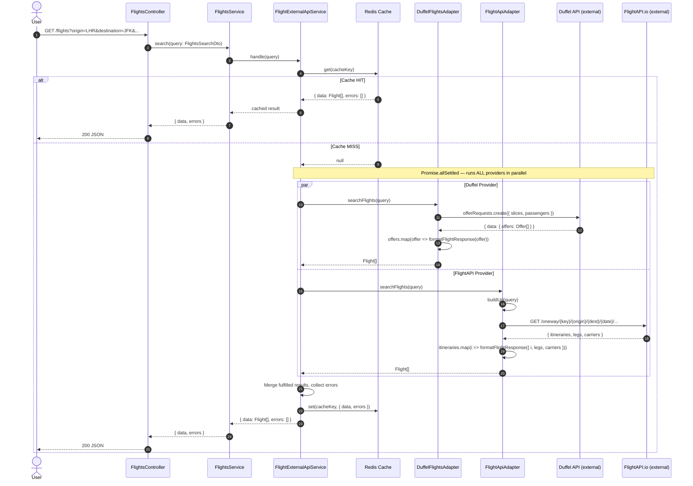
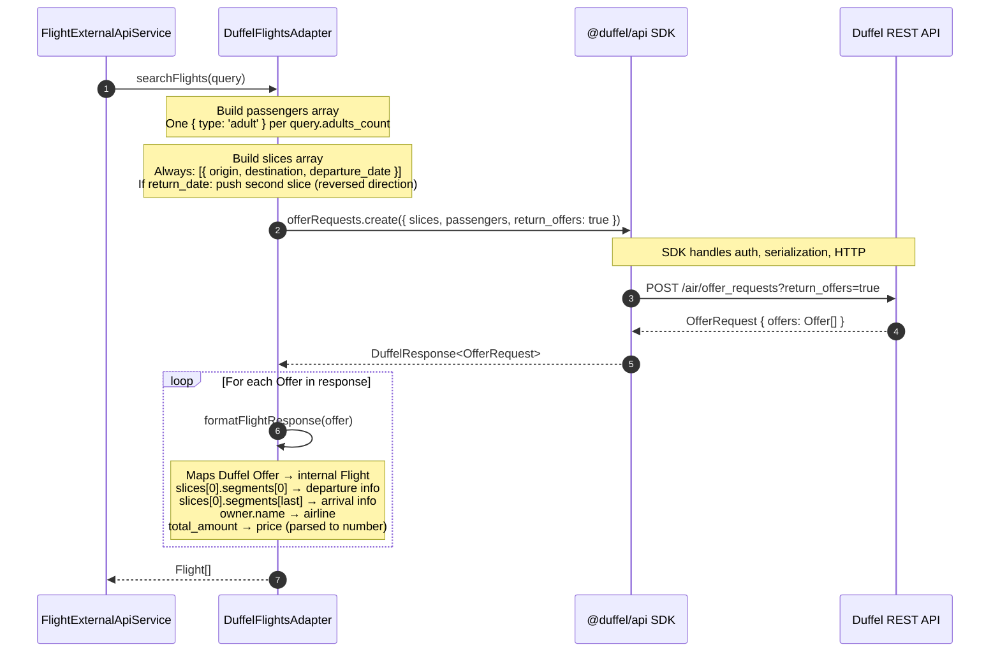
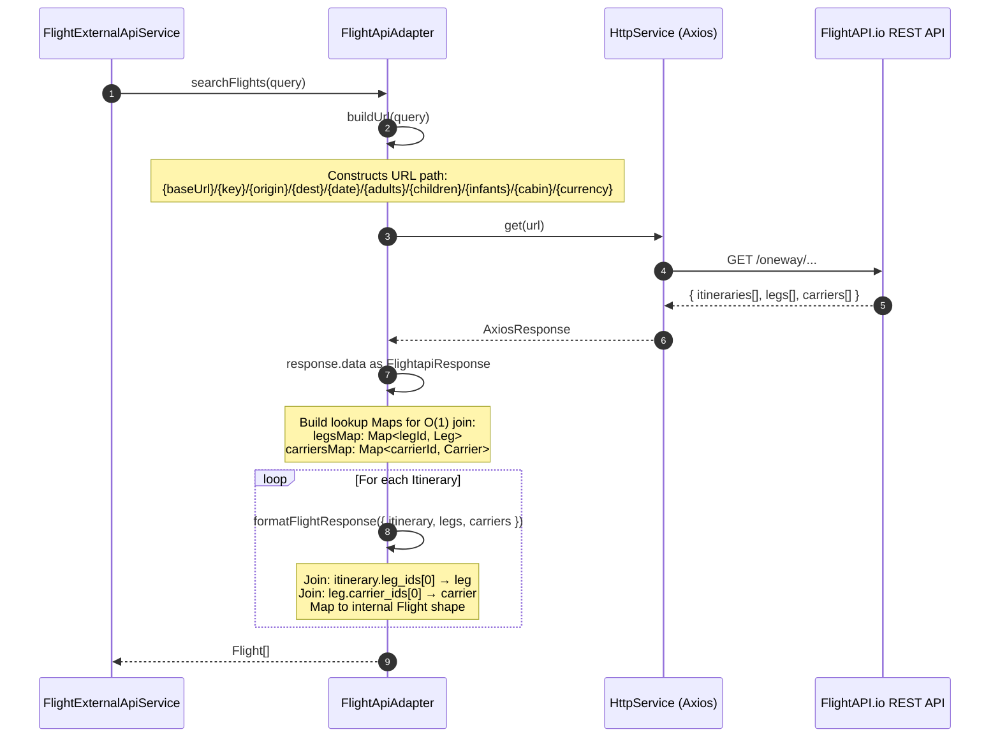
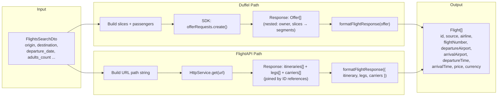

# Providers Module — Sequence Diagrams

This document explains the flow of data through the Providers Module when a flight search request arrives.

---

## Full Flight Search Flow (Scatter-Gather)

When a user sends a `GET /flights` request, the system fans out to **all registered providers simultaneously**, collects what it can, and returns the merged result. This pattern is called **Scatter-Gather**.

---

## Duffel Adapter: Internal Flow

This diagram shows what happens specifically inside the `DuffelFlightsAdapter` when it processes a search query.

---

## FlightAPI.io Adapter: Internal Flow

This diagram shows what happens inside the `FlightApiAdapter`.

---

## The Adapter Pattern: Side-by-Side Comparison

The two adapters implement the **same interface** but translate **completely different API shapes** into the same `Flight` output. This is the core value of the Adapter Pattern.

---

## Error Handling Comparison

Both adapters handle errors, but the error shapes from the two providers are completely different.

| Scenario | Duffel | FlightAPI.io |
|---|---|---|
| **Bad API key / Unauthorized** | SDK throws with `error.errors[0].message` | Axios response with `status: 401` |
| **Generic failure** | Standard JS `Error.message` | Standard JS `Error.message` |
| **NestJS exception thrown** | `UnauthorizedException` or `BadRequestException` | `UnauthorizedException` or `BadRequestException` |

Both adapters wrap all errors in NestJS HTTP exceptions so that the `FlightExternalApiService` can catch them uniformly via `Promise.allSettled()`. A provider failure never crashes the whole request — it gets recorded in the `errors[]` array and returned alongside any successful results from other providers.
